<div align="center">



<br/>

<a href="https://git.io/typing-svg">
  
</a>

<br/>


</div>

---

### 🧑‍💻 About Me

```yaml
name: Vineet Mittal
role: Frontend Developer | Machine Learning Enthusiast
currently_learning: [Data Structures & Algorithms, AI/ML]
status: Open to Opportunities
motto: "code. break. fix. repeat."
```

- 💻 I build clean, responsive front-end experiences and I'm diving deep into **Machine Learning**.
- 📚 Currently sharpening my problem-solving with **DSA**.
- 🌱 Always experimenting with new frameworks and tools.
- 🤝 Open to internships / full-time roles — let's connect!
- ⚡ Fun fact: this README animates itself, just like I keep shipping updates to my own skills.

---

### 🛠️ Tech Stack

<div align="center">

| Frontend | Machine Learning | DSA / Core | Tools |
|:---:|:---:|:---:|:---:|
|  |  |  |  |
|  |  |  |  |
|  |  |  |  |
|  |  | |  |


</div>

---

### 📊 GitHub Stats & Activity


<div align="center">



</div>

<div align="center">


</div>

<div align="center">

### 📈 Daily Contribution Graph


</div>

---

### 🐍 Contribution Snake

> A pixel snake that eats through my daily commit graph — runs automatically every day via GitHub Actions.

<div align="center">
  
</div>

---

### 🌐 Connect With Me

<div align="center">

[](https://www.linkedin.com/in/vineet-mittal-52b5901b3/)
[](https://www.instagram.com/vineetm1204/)
[](mailto:vineetm1204@gmail.com)
[](tel:+917049915277)

</div>

---

<div align="center">
<sub>⭐ If this README inspired your own profile, feel free to fork the idea — that's the whole point.</sub>
</div>